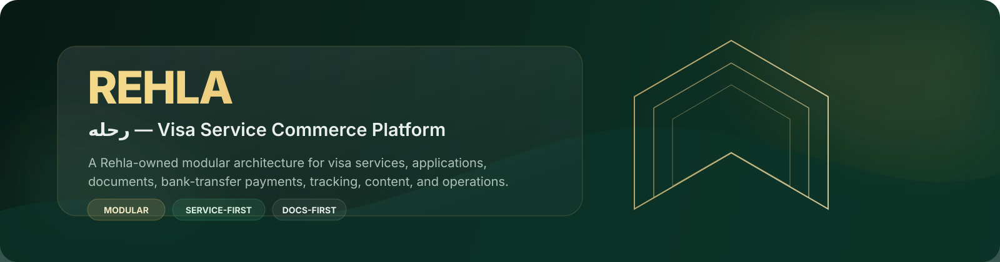
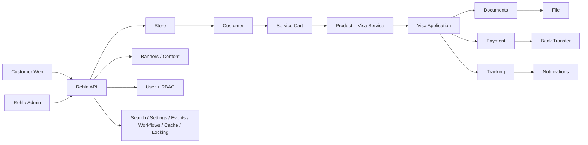

<div align="center">
  
</div>

<div align="center">

[](docs/development/architecture.md)
[](docs/development/constitution.md)
[](docs/development/architecture.md)
[](docs/development/plans/README.md)
[](docs/development/architecture.md)

**Rehla (رحله)** is a Rehla-owned service-commerce platform focused on visa services for Sudanese travelers, with an operational Admin experience, customer storefront, application lifecycle, document handling, bank-transfer payments, and application tracking.

[Architecture](docs/development/architecture.md) · [Roadmap](docs/development/roadmap.md) · [Constitution](docs/development/constitution.md) · [Implementation Plans](docs/development/plans/README.md) · [Decisions](docs/development/decisions/)

</div>

---

## ✦ What is Rehla?

Rehla is designed around **visa services as commerce products** and **visa applications as a separate business domain**.

The platform is intentionally narrower than a general-purpose travel marketplace. Its architecture is centered on the capabilities that actually belong to Rehla:

| Capability | Rehla responsibility |
|---|---|
| **Visa Services** | Catalog and sell visa services, including Umrah and Gulf tourist visas |
| **Customers** | Customer identity, profile, and service-commerce context |
| **Applications** | Visa application lifecycle and business state |
| **Documents** | Applicant document requirements, submission, and review |
| **Payments** | Bank-transfer payment flow and receipt verification |
| **Tracking** | Customer-visible application progress and status history |
| **Notifications** | Operational and customer notifications |
| **Content** | Banners and storefront content |
| **Admin** | Operations, permissions, reporting, and resource management |

### Explicitly outside the current baseline

Rehla does **not** include flight booking, hotel booking, travel-agency marketplace behavior, shipping/fulfillment logistics, or physical-goods inventory workflows.

---

## ◈ Architecture at a Glance

Rehla follows a **Rehla-owned modular monolith**. The architecture takes useful boundaries and patterns from the analyzed Medusa ecosystem without making Medusa a fork, dependency tree, or second application source tree.



### Domain relationship model

```text
Store
├── Customer
│   └── Cart
│       └── Line Item
│           └── Product = Visa Service
│               └── Application
│                   ├── Documents → File
│                   ├── Payment
│                   └── Tracking → Notification
└── Admin User → RBAC

Banner = application/content feature
```

The important boundary is deliberate:

> **Product represents the visa service that is sold. Application represents the visa request created from that service.**

There is therefore no need to turn `Visa` into a second commerce catalog concept.

---

## ⬢ Repository Shape

```text
rehla/
├── apps/
│   ├── api/
│   │   └── src/
│   │       ├── api/
│   │       ├── features/
│   │       ├── workflows/
│   │       ├── subscribers/
│   │       ├── jobs/
│   │       ├── links/
│   │       ├── search/
│   │       ├── feature-flags/
│   │       └── loaders/
│   │
│   ├── admin/                         # Operational dashboard
│   └── web/                           # Customer storefront
│
├── packages/
│   ├── modules/
│   │   ├── store/
│   │   ├── customer/
│   │   ├── user/
│   │   ├── auth/
│   │   ├── rbac/
│   │   ├── product/
│   │   ├── cart/
│   │   ├── pricing/
│   │   ├── currency/
│   │   ├── region/
│   │   ├── application/
│   │   ├── documents/
│   │   ├── tracking/
│   │   ├── payment/
│   │   ├── notification/
│   │   ├── file/
│   │   ├── translation/
│   │   ├── search/
│   │   ├── settings/
│   │   ├── analytics/
│   │   ├── api-key/
│   │   ├── event-bus-*/
│   │   ├── workflow-engine-*/
│   │   ├── locking/
│   │   ├── caching/
│   │   └── link-modules/
│   │
│   ├── ui/                            # Generic design-system primitives
│   ├── icons/
│   ├── sdk/
│   ├── contracts/
│   └── config/
│
├── integration-tests/
├── docs/
└── scripts/
```

### Design-system boundary

`packages/ui` stays **generic**.

Business resources such as:

`Visa Services · Applications · Documents · Payments · Tracking · Customers · Admin Users`

belong to the Admin application rather than becoming domain-specific UI packages.

---

## ◆ Core Modules

### Platform & access

`auth` · `user` · `rbac` · `api-key`

Authentication, staff identity, roles, permissions, and controlled integrations.

### Commerce foundation

`store` · `customer` · `product` · `pricing` · `currency` · `region` · `cart`

The commerce layer is retained only where it matches Rehla's service-commerce model.

### Rehla domain

`application` · `documents` · `tracking`

These are first-class Rehla capabilities with their own business rules, persistence, service contracts, and tests.

### Supporting infrastructure

`payment` · `file` · `notification` · `translation` · `search` · `settings` · `analytics` · `event-bus` · `workflow-engine` · `locking` · `caching` · `link-modules`

These capabilities support the domain without owning Rehla-specific business meaning.

---

## ◎ Selective Medusa Compatibility

Medusa is treated as an **architectural reference and source of compatible patterns**, not as the owner of Rehla.

| Area | Rehla treatment |
|---|---|
| Auth / User / RBAC | **Keep / adapt** |
| Customer / Store | **Keep / adapt** |
| Product / Pricing / Currency / Region | **Keep / adapt** |
| Cart | **Adapt for service commerce** |
| Payment | **Adapt with Bank Transfer provider** |
| File / Notification / Translation / Search / Settings | **Keep / adapt** |
| Event Bus / Workflows / Caching / Locking / Links | **Keep / adapt** |
| Application / Documents / Tracking | **Rehla-specific** |
| Banners / Content | **Application feature** |
| Fulfillment / Inventory / Stock Location | **Exclude from baseline** |
| Flight / Hotel booking | **Exclude from baseline** |
| Travel-agency marketplace | **Exclude from baseline** |
| Physical-goods logistics | **Exclude from baseline** |

The governing rule is simple: **reuse the smallest compatible building block rather than importing unrelated commerce behavior.**

---

## ◉ Application Lifecycle

```text
Cart
  ↓
Application Draft
  ↓
Application Submitted
  ↓
Documents Submitted / Reviewed
  ↓
Payment Submitted
  ↓
Payment Verified / Rejected
  ↓
Application Processing
  ↓
Status Changes
  ↓
Completed / Rejected / Cancelled
```

The lifecycle is enforced in backend services/workflows rather than relying on Admin UI behavior alone.

---

## ◇ Payment Model

Rehla uses a provider-oriented payment boundary while implementing the current business flow as **bank transfer**.

```text
Payment Module
      │
      └── Rehla Bank Transfer Provider
              ├── Transfer Instructions
              ├── Receipt Reference
              ├── Submission State
              └── Admin Verification / Rejection
```

Receipt files are handled through the File abstraction, keeping storage concerns separate from payment business rules.

---

## ▣ Admin Experience

The Admin is an operational application, not a domain module.

Its resource surface is organized around Rehla operations:

```text
Dashboard
├── Customers
├── Visa Services
├── Applications
├── Documents
├── Payments
├── Tracking
├── Banners / Content
├── Admin Users
├── Roles / Permissions
├── Settings
└── Reports / Analytics
```

The UI can use the same useful interaction patterns found in the analyzed Medusa dashboard—resource routing, query/data hooks, tables, permission guards, layouts, and extension zones—while remaining a Rehla-owned implementation.

---

## ✦ Development Philosophy

### Domain first

Rehla terminology is authoritative. Framework terminology is used only where it provides a useful implementation mechanism.

### Explicit boundaries

Modules own their persistence and business logic. Cross-module relationships use explicit links, workflows, or service contracts.

### Backend before surfaces

```text
Schema / Model
      ↓
Module Service
      ↓
Workflow / Event / Link
      ↓
API Contract
      ↓
Admin / Web
      ↓
Automated Verification
      ↓
Manual Verification
```

### Incremental verification

Every implementation package is designed to be built, verified, and understood independently before the next dependent package is started.

---

## ▲ Implementation Roadmap

The build is organized into dependency-aware implementation plans from foundation through production release.

| Phase | Deliverable |
|---:|---|
| `00` | Foundation & Monorepo |
| `01` | Architecture & Module Boundaries |
| `02` | Medusa Compatibility & Selective Reuse |
| `03` | Authentication |
| `04` | Store, Customer, User & RBAC |
| `05` | Visa Product Catalog |
| `06` | Pricing, Currency & Region |
| `07` | Service Cart |
| `08` | Visa Applications |
| `09` | Documents & File Storage |
| `10` | Bank-Transfer Payment |
| `11` | Tracking & Notifications |
| `12` | Banners & Content |
| `13` | Search, Translation & Settings |
| `14` | Workflows, Events, Jobs & Links |
| `15` | Admin Shell |
| `16` | Admin Resources |
| `17` | Web Storefront |
| `18` | Testing, Security & Quality |
| `19` | Observability & Analytics |
| `20` | Infrastructure, CI/CD & Staging |
| `21` | Production Release |

→ **Full roadmap:** [`docs/development/roadmap.md`](docs/development/roadmap.md)

---

## ▤ Documentation Map

```text
docs/
└── development/
    ├── constitution.md
    ├── architecture.md
    ├── dependency-graph.md
    ├── roadmap.md
    ├── decisions/
    │   └── 001-medusa-without-copying.md
    └── plans/
        ├── 00-foundation.md
        ├── 01-architecture.md
        ├── 02-medusa-compatibility.md
        ├── 03-auth.md
        ├── 04-store-customer-user-rbac.md
        ├── 05-product-visa.md
        ├── 06-pricing-currency-region.md
        ├── 07-cart.md
        ├── 08-application.md
        ├── 09-documents-file.md
        ├── 10-payment-bank-transfer.md
        ├── 11-tracking-notifications.md
        ├── 12-banners-content.md
        ├── 13-search-translation-settings.md
        ├── 14-workflows-events-jobs.md
        ├── 15-admin-shell.md
        ├── 16-admin-resources.md
        ├── 17-web-storefront.md
        ├── 18-testing-quality-security.md
        ├── 19-observability-analytics.md
        ├── 20-infrastructure-deployment.md
        └── 21-production-release.md
```

---

## ⚙️ Local Development

> The exact runtime/tooling commands are intentionally kept in the implementation plans rather than duplicated here. This README is the project entry point; the phase plans are the executable source of truth for build steps and verification.

Start with:

```text
00 Foundation
   ↓
01 Architecture
   ↓
02 Compatibility
   ↓
03–17 Product Build
   ↓
18 Quality Gates
   ↓
19 Observability
   ↓
20 Staging
   ↓
21 Production
```

---

## ✅ Quality Gates

A phase is not considered complete merely because its code exists.

The project plans require:

- Automated verification for implemented behavior.
- Manual verification for user-facing and operational behavior.
- Tests at the appropriate module/integration boundary.
- Security and permission verification before production.
- Verification of dependencies and cross-module contracts.

See [`docs/development/plans/README.md`](docs/development/plans/README.md) for the complete execution structure.

---

## 🔐 Security & Access Model

Rehla separates:

```text
Customer Identity
        │
        └── Customer-facing capabilities

Admin / Staff Identity
        │
        └── RBAC → Roles → Permissions → Admin Resources
```

Operationally sensitive capabilities—especially payment verification, application status transitions, document review, and staff administration—are permission-controlled resources.

---

## 🧭 Project Principles

> **Rehla owns the architecture.**

> **Product is the visa service; Application is the visa request.**

> **Modules own business capabilities.**

> **Links model cross-module relationships.**

> **Workflows coordinate multi-step business operations.**

> **Events and jobs handle asynchronous side effects.**

> **Generic UI stays generic; domain resources stay in Admin.**

> **Excluded commerce capabilities stay out of the baseline.**

---

## 📌 Current Scope

**Included:** Visa Services · Umrah / Gulf Tourist Visas · Customers · Applications · Documents · Bank Transfer · Receipt Review · Tracking · Notifications · Banners / Content · Admin · RBAC · Reporting.

**Excluded:** Flights · Hotels · Travel-agency Marketplace · Shipping / Fulfillment · Physical Inventory.

---

## 🤝 Contribution & Change Discipline

Changes should follow the dependency order documented in the project plans.

A feature should not introduce a new abstraction merely because an upstream platform contains one. New capabilities must have a Rehla business reason, a defined boundary, an implementation package, and automated verification.

Architecture-changing decisions belong in `docs/development/decisions/` so the repository keeps a durable record of why the system looks the way it does.

---

## 📚 Start Here

| Need | Document |
|---|---|
| Understand the architecture | [`architecture.md`](docs/development/architecture.md) |
| Understand the project rules | [`constitution.md`](docs/development/constitution.md) |
| Follow implementation order | [`roadmap.md`](docs/development/roadmap.md) |
| Execute a specific work package | [`plans/`](docs/development/plans/README.md) |
| Understand Medusa reuse boundaries | [`001-medusa-without-copying.md`](docs/development/decisions/001-medusa-without-copying.md) |

---

<div align="center">

### رحله · Rehla

**Visa services, applications, documents, payments, and tracking — designed as one coherent platform.**

</div>
